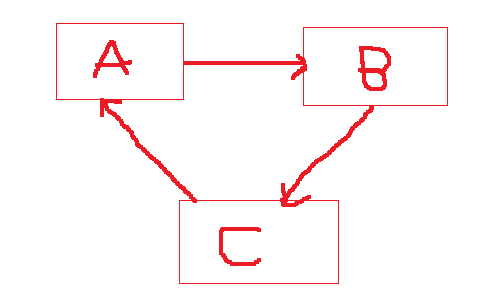

# Circular Dependency Injection



Salah/SatuBean.java
```java
public class SatuBean {

    private DuaBean duaBean;

    public SatuBean(DuaBean duaBean) {
        this.duaBean = duaBean;
    }

    public DuaBean getDuaBean() {
        return duaBean;
    }

    public void setDuaBean(DuaBean duaBean) {
        this.duaBean = duaBean;
    }
}
```

Salah/DuaBean.java
```java
public class DuaBean {

    private TigaBean tigaBean;

    public DuaBean(TigaBean tigaBean) {
        this.tigaBean = tigaBean;
    }

    public TigaBean getTigaBean() {
        return tigaBean;
    }

    public void setTigaBean(TigaBean tigaBean) {
        this.tigaBean = tigaBean;
    }
}

```

Salah/TigaBean.java
```java
public class TigaBean {

    private SatuBean satuBean;

    public TigaBean(SatuBean satuBean) {
        this.satuBean = satuBean;
    }

    public SatuBean getSatuBean() {
        return satuBean;
    }

    public void setSatuBean(SatuBean satuBean) {
        this.satuBean = satuBean;
    }
}

```

SalahConfiguration.java
```java
@Configuration
public class SalahConfiguration {

    @Bean
    public SatuBean createSatuBean(DuaBean duaBean){
        return new SatuBean(duaBean);
    }

    @Bean
    public DuaBean createDuaBean(TigaBean tigaBean){
        return new DuaBean(tigaBean);
    }

    @Bean
    public TigaBean createTigaBean(SatuBean satuBean){
        return new TigaBean(satuBean);
    }

}
```

BelajarConfiguration.java
```java
@SpringBootApplication
@Import(SalahConfiguration.class)
public class BelajarConfiguration {

    
}
```