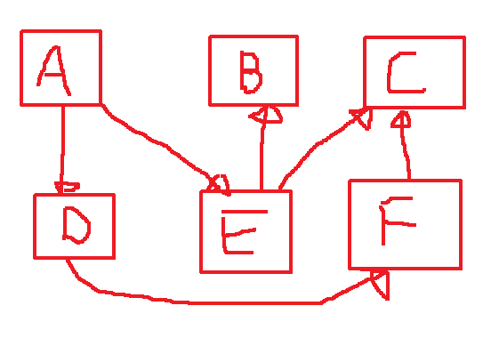

# Dependency Injection




```java
Class A {
    private D dataD;
    private E dataE;

    public A(D inputD, E inputE){
        this.dataD = inputD;
        this.dataE = inputE;
    }
}

A field = new A(inputD, inputE)
```

# Inversion of Control

Biasanya dalam aplikasi-aplikasi yang sederhana tahapan-tahapannya berjalan secara sequential atau berurutan contohnya :

1. Buka koneksi ke database
2. Input data
3. Insert Data
4. ...
5. ...
6. Tutup koneksi ke database

permasalahnnya pada system Enterprise atau sistem yang besar, flow sistem tidak berjalan secara sequential seperti di atas. biasanya adalah berdasarkan interaksi yang diterima oleh usernya.

```java
actionInsert(){
    A field = new A(...)
}
```

```java
actionUpdate(){
    A field = new A(...)
}
```

```java
actionDelete(){
    A field = new A(...)
}
```