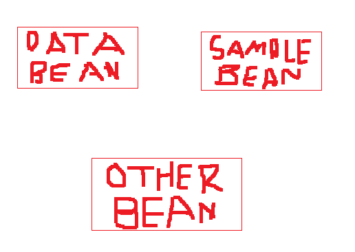

# Dependency Injection 3



File Model/OtherBean.java
```java
public class OtherBean {

    private DataBean dataBean;
    private SampleBean sampleBean;

    public OtherBean(DataBean dataBean, SampleBean sampleBean) {
        this.dataBean = dataBean;
        this.sampleBean = sampleBean;
    }

    public DataBean getDataBean() {
        return dataBean;
    }

    public void setDataBean(DataBean dataBean) {
        this.dataBean = dataBean;
    }

    public SampleBean getSampleBean() {
        return sampleBean;
    }

    public void setSampleBean(SampleBean sampleBean) {
        this.sampleBean = sampleBean;
    }
}
```

Class Belajar Configuration
```java
@SpringBootApplication
public class BelajarConfiguration {

    @Bean(name = "alfin")
    @Primary
	public DataBean createDataBean(){
        DataBean bean = new DataBean("Alfin");
        return bean;
    }

    @Bean(name = "andika")
	public DataBean createDataBean(){
        DataBean bean = new DataBean("Andika");
        return bean;
    }

    @Bean
    public SampleBean createSampleBean(@Qualifier("Andika") DataBean dataBean){
        SampleBean bean = new SampleBean(dataBean);
        return bean;
    }

    @Bean
    public OtherBean createOtherBean(@Qualifier("Alfin") DataBean dataBean, SampleBean sampleBean){
        OtherBean bean = new OtherBean(dataBean, sampleBean);
        return bean;
    }
}
```
Class main
```java
public class BelajarSpringApplication {

	public static void main(String[] args) {
        ApplicationContext context = SpringApplication.run(BelajarConfiguration.class, args);

        OtherBean otherBean = context.getBean(OtherBean.class);
		System.out.println(otherBean.getDataBean().getValue());
		System.out.println(otherBean.getSampleBean().getDataBean().getValue());
    }
}
```